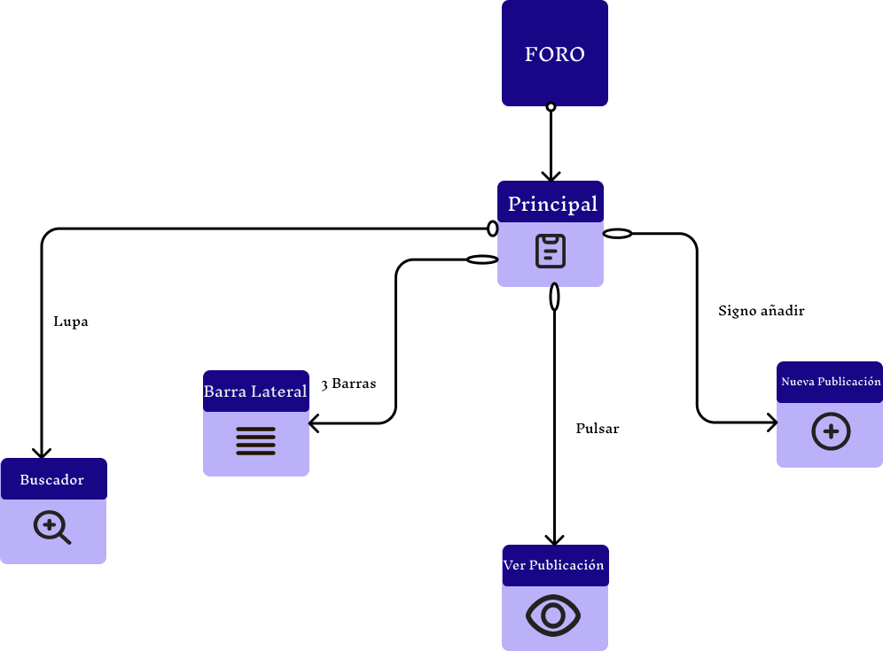

## DIU - Practica2

### IDEACIÓN 

Tras haber terminado la practica 1, hemos llegado a diversas conclusiones respecto a la web *Moda re-*. Para expresarlas, hemos creado una malla receptoram en con distintos campos de información. 
 
**1. Worked:** Puntos positivos que hemos encontrado sobre la web.
 
**2. Change:** Problemas claros a nivel de usabilidad.
 
**3. Questions:** Preguntas que un usuario puede llegar a preguntarse nada más entrar a la página.
 
**4. Ideas:** Distintas propuestas de mejora.

### PROPUESTA DE VALOR

Tras haber analizado el diseño de la página web actual, hemos encontrado que una de las principales mejoras que podemos implementar, es el añadir una especie de foro, donde los distintos usuarios de forma pública, pueden añadir posts. El hilo de conversación sobre estos posts obviamente, girarán en torno a la ropa reciclada, y derivados de este. Además de compartir alguna experiencia personal, compartir tips sobre un estilo de vida reciclable etc. La imaginación es infinita, y los usuarios tendrán total libertad en este aspecto.

Aun así, esta libertad no puede ser total. Si cualquier usuario puede escribir lo que quiera, la página no tardará en llenarse de posts que no tengan nada que ver sobre el tema principal. Para ello, se tendrán varios filtros para controlar este hilo de posts:

1. Los propios usuarios, podrán valorar con un sistema interno de "felicidad" basado en tortugas. Si les gusta, y están de acuerdo con este, sumarán en uno, el contador de tortugas sanas y felices. Si no están de acuerdo, sumarán en uno, el contador de tortugas tristes y difuntas :(

2. Habrá un tipo de usuario, denominado, "usuario admin", el cual tiene poder sobre los post ajenos, pudiendo eliminar alguno de ellos, si lo considera ofensivo.

3. Habrá a su vez un filtro automático por código, el cual no dejará publicar posts que detecte que contenga palabras palabras malsonantes. 

### TASK ANALYSIS

Hemos diseñado los pasos a seguir para 3 de las acciones que podrán realizar los usuarios que interactúen con nuestra propuesta de funcionalidad.

- Añadir una nueva publicación:

- Ver las publicaciones de los demás:

### ARQUITECTURA DE INFORMACIÓN

#### SiteMap (Mapa de sitio)
Es una representación estructurada de las páginas y contenido dentro de un sitio web o aplicación. Sirve como una guía para entender la organización y la jerarquía de la información. Vamos a definir la navegabilidad y la indexación de nuestra plataforma, beneficiando la experiencia de los usuarios.
  
El Sitemap de nuestra implementación es realmente básico, ya que al acceder al foro todo girará en torno al carrusel vertical de las publicaciones. Las distintas ventanas que aparecen, como la lateral o la de publicación de un nuevo post, son ventanas emergentes, que se muestran encima de la original. Partiendo de esto, llegamos a la siguiente estructura: 

* Labelling

| Término         | Significado                                                             |
| -------------- | ---------------------------------------------------------------------- |
| FORO           | Ingresamos a la implementación                                       |
| Principal      | Pantalla principal que nos aparece al ingresar                       |
| Publicaciones  | Ventana que mediante scroll, vemos los distintos posts.              |
| Nueva Publicación | Ventana emergente que nos permite añadir un post.                  |
| Barra Lateral  | Menú desplegable, para ordenar y ver marcadores globales de tortugas. |
| Buscador       | Ingresamos texto para filtrar los posts.                             |

### Prototipo Lo-FI Wireframe 

### Conclusiones  
(incluye valoración de esta etapa)

>>>> Este fichero se debe editar para que cada evidencia quede enlazada con el recurso subido a la carpeta de la practica. Se pide más detalle técnico en las descripciones de lo que sería el README principal del repositorio y que corresponde a la descripcion del Case Study.
>>>> Termine con la seccion de Conclusiones para aportar una valoración final del equipo sobre la propia realización de la práctica
