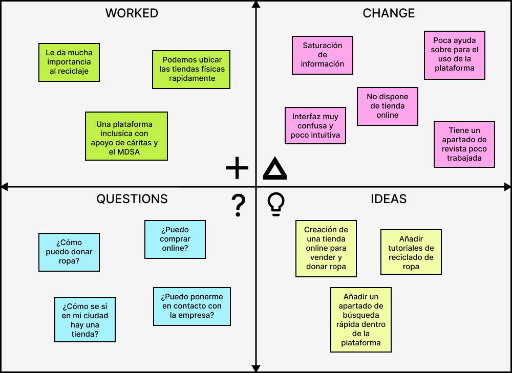

## DIU - Practica2

### IDEACIÓN 

Tras haber terminado la practica 1, hemos llegado a diversas conclusiones respecto a la web *Moda re-*. Para expresarlas, hemos creado una malla receptoram en con distintos campos de información. 
 
**1. Worked:** Puntos positivos que hemos encontrado sobre la web.
 
**2. Change:** Problemas claros a nivel de usabilidad.
 
**3. Questions:** Preguntas que un usuario puede llegar a preguntarse nada más entrar a la página.
 
**4. Ideas:** Distintas propuestas de mejora.

### PROPUESTA DE VALOR
* ScopeCanvas

### TASK ANALYSIS

* User Task Matrix 
* User/Task flow

### ARQUITECTURA DE INFORMACIÓN

* Sitemap 
* Labelling 

### Prototipo Lo-FI Wireframe 

### Conclusiones  
(incluye valoración de esta etapa)

>>>> Este fichero se debe editar para que cada evidencia quede enlazada con el recurso subido a la carpeta de la practica. Se pide más detalle técnico en las descripciones de lo que sería el README principal del repositorio y que corresponde a la descripcion del Case Study.
>>>> Termine con la seccion de Conclusiones para aportar una valoración final del equipo sobre la propia realización de la práctica
