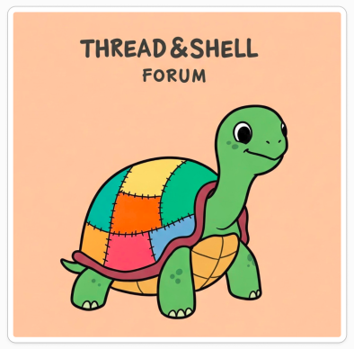
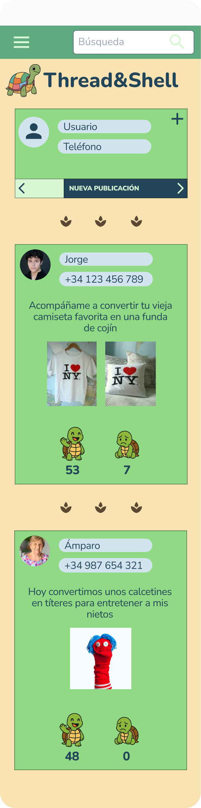
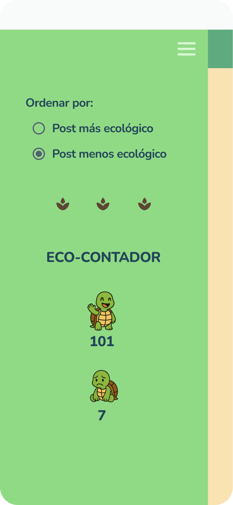

# DIU - Practica 3, entregables

## Paso 3. Mi UX-Case Study (diseño)

El nombre que hemos elegido es: **Thread&Shell**

Hemos intentado unificar la idea principal de nuestro proyecto, que es el de un foro de posts sobre el que ir scrolleando, por eso el término de **Thread** (hilo de posts) con el tema principal de nuestra página, la ecología, por eso hacemos referencia al caparazon de las tortugas, elemento que sale a lo largo de la página **Shell**.

**Enlace a la simulación de la Práctica 3:** [Enlace a Figma](https://www.figma.com/design/IB9CthJOS3Id6D8RaYn6hK/mockup_DIU3.Pizza-con-Curry?node-id=1-1177&t=G2DJpqDr0hCOBTWi-0)
 **Enlace a un tutorial de nuestra app:** [Tutorial Thread&Shell](https://github.com/DIU3-Pizza-con-Curry/UX_CaseStudy/blob/master/P3/tutorial_thread%26shell.mp4)

### 3.a Moodboard

Para el diseño visual de nuestra aplicación "Thread&Shell", hemos diseñado un Moodboard en el que hemos plasmado los patrones y características de diseño que tiene una aplicación. Dentro de nuestro Moodboard hemos añadido lo siguiente:

- **Nuestra estrategia de marca:** para marcar los puntos de nuestra visión a la hora de enfocar la aplicación, estableciendo así el nombre definitivo de nuestra página.
- **Estilo de nuestro logo:** hemos creado una imagen utilizando inteligencia artificial de una tortuga para utilizarla como logo. Nuestra idea es que las tortugas sean nuestra seña de identidad, pues es un elemento que utilizamos constantemente.
  
 

  

 

- **Nuestro branding:** establecemos un eslogan como empresa, buscando atraer a un público ecologista y de bienestar con el juego de palabras de "Thread Shell = Tortugas felices".
- **Paleta de colores:** utilizamos distintos tonos de verde, que son colores que nos acercan a la naturaleza.
  
 

  

 

- **Tipografia:** utilizamos letras con un estilo minimalista, que sean fáciles de leer en dispositivos pequeños.
- **Imágenes:**  hemos insertado una serie de imágenes, entre las que encontramos las tortugas felices/tristes y distintos iconos que indican funcionalidades dentro de nuestra aplicación.

Hemos añadido mensajes de inspiración basados en posibles usuarios además de imágenes que hemos utilizado como inspiración de estilo para forjar el nuestro propio.

 

  

 

### 3.b Landing Page

Para la Landing Page, no buscabamos una vista demasiado llamativa, mas bien lo contrario, que fuera simple directa y que se entendiese rapido el mensaje. En esta como carta de presentada, escribimos varios mensajes llamativos e incentivos al usuario, para que se interese por descargar nuestro foro, planteando ya desde primeras el tono ecologista que caracteriza a nuestra aplicacion. También mostramos nuestro logo, que es nuestra seña de identidad en varios puntos, como en el fondo de la landing page, abarcando esta, y en el header. Sin olvidar, que la función principa de esta, es que el usuario se interese e instale nuestra app, siendo este botón el más llamativo y accesible de esta página.

 

  

 

### 3.c Guidelines

Nos hemos estado documentando en UI Patterns para definir los siguientes patrones de diseño que hemos implementado en nuestro foro de publicaciones. Estos patrones garantizan una experiencia de usuario clara, intuitiva y coherente durante su uso.

**Navegación y Contenido:**

- **1. NavBar**: Hemos planteado una navegación clara en la parte superior. Nos permite abrir rápidamente la barra lateral o realizar búsquedas en el foro en cualquier momento.

- **2. Search**: Tenemos una barra de búsqueda visible y funcional que nos permite escribir para encontrar publicaciones específicas mediante palabras clave o usuarios.

- **3. Infinite Scroll**: El contenido se va cargando a medida que el usuario va haciendo scroll en la página principal.

- **4. Feed/List View (Cards)**: Las publicaciones se ven como tarjetas verticales que están ordenadas cronológicamente o por relevancia. Este formato mejora la legibilidad y separa claramente los posts entre sí.

- **5. Modal View**: Al pulsar sobre la primera publicación que nos permite añadir un nuevo post, se abre una ventana emergente que permite escribir la información necesaria para publicarlo o simplemente volver hacia atrás.

- **6. Lateral Menu**: Barra lateral desplegable que permite ordenar el contenido por criterios como “Más valorados” o “Menos valorados”, adaptando el foro a las preferencias del usuario.

**Interacción y Acciones de Usuario**

- **7. Like / Dislike Buttons**: Botones accesibles para valorar las publicaciones de forma rápida. Aumentan la interacción con el usuario y ayudan a destacar el contenido relevante.

- **8. Quick Post Form**: Contamos con un "formulario" rápido y accesible que nos permite escribir nuevas publicaciones ingresando pocos campos de texto, solo los imprescindibles.

- **9. Item Details + Actions**: Obtenemos una vista más detallada sobre cada publicación al interactuar con ella.

**Comunicación y Retroalimentación**

- **10. Toasts / Snackbars**: Mensajes breves, ya sean visuales o de texto, que confirman acciones importantes como publicar, dar like o dislike.

### 3.d Mockup

**Cargar web:**
 

  

 

**Pantalla de inicio:**
 

  
  

 

**Filtro:**
 

  
  

 

**Nueva publicación:**
 

  
  

 

**Publicación Amparo:**
 

  
  
  

 

**Publicación Jorge:**
 

  
  
  

 

### 3.e ¿My UX-Case Study?
 
-----

Para que el funcionamiento de el diseño en Figma de nuestro foro quede claro, hemos añadido un video a modo de tutorial, en el que mostramos de que manera podemos interactuar con el:

**Enlace a la simulación de la Práctica 3:** [Enlace a Figma](https://www.figma.com/design/IB9CthJOS3Id6D8RaYn6hK/mockup_DIU3.Pizza-con-Curry?node-id=1-1177&t=G2DJpqDr0hCOBTWi-0)
 **Enlace a un tutorial de nuestra app:** [Tutorial Thread&Shell](https://github.com/DIU3-Pizza-con-Curry/UX_CaseStudy/blob/master/P3/tutorial_thread%26shell.mp4)

 

### 3.f Conclusiones

Con este trabajo y sobre todo con nuestra aplicación Thread&Shell, hemos buscado crear un espacio en línea donde la conversación sobre moda reciclada fluya de manteral natural y sea agradable para los distintos tipos de usuarios. Este proyecto ha echo que aprendamos como aplicar principios de diseño UX para desarollar una plataraforma, que esperemos que sea inuitiva, atractiva y sobre todo disfrutona. Tan drisfutona como nosotros hemos disfrutado haciendola.

 

