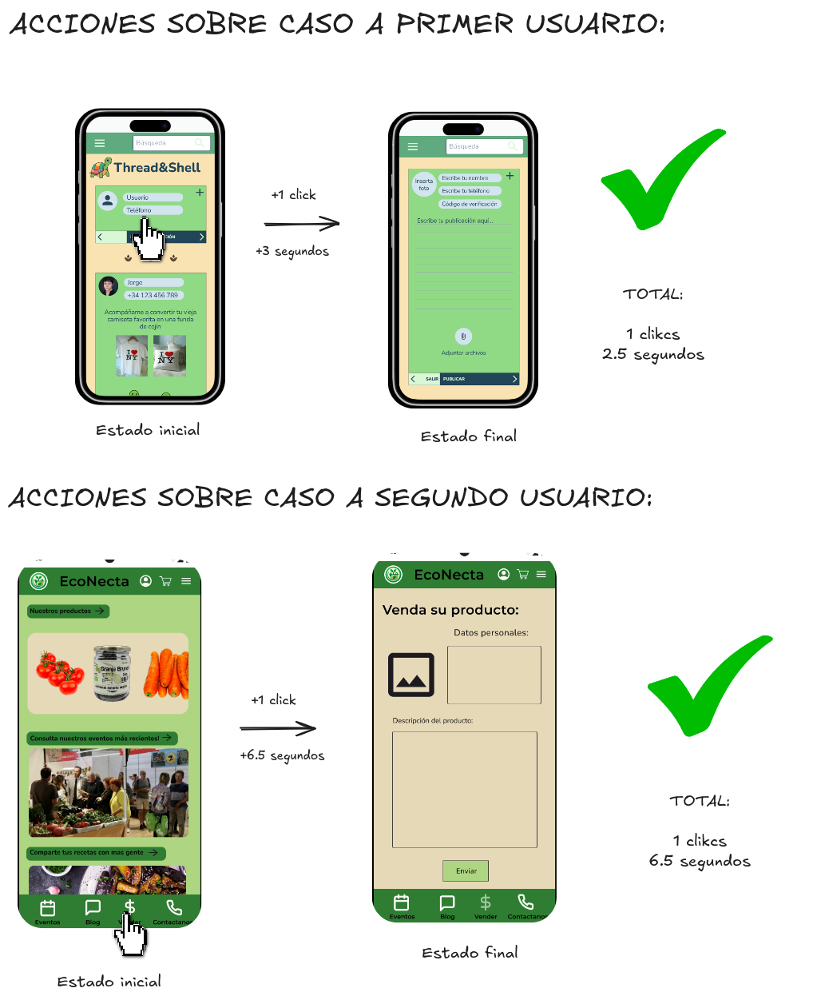
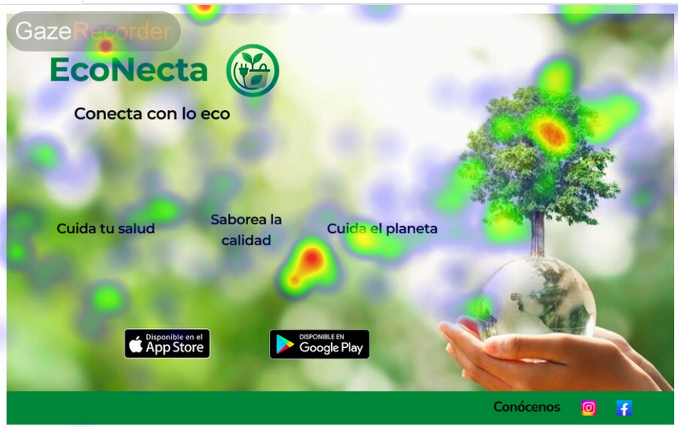
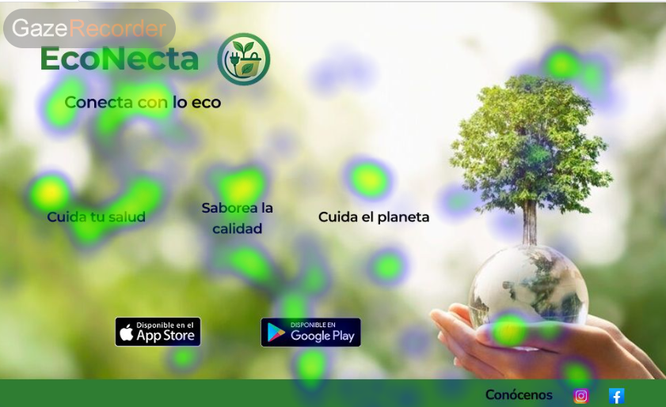
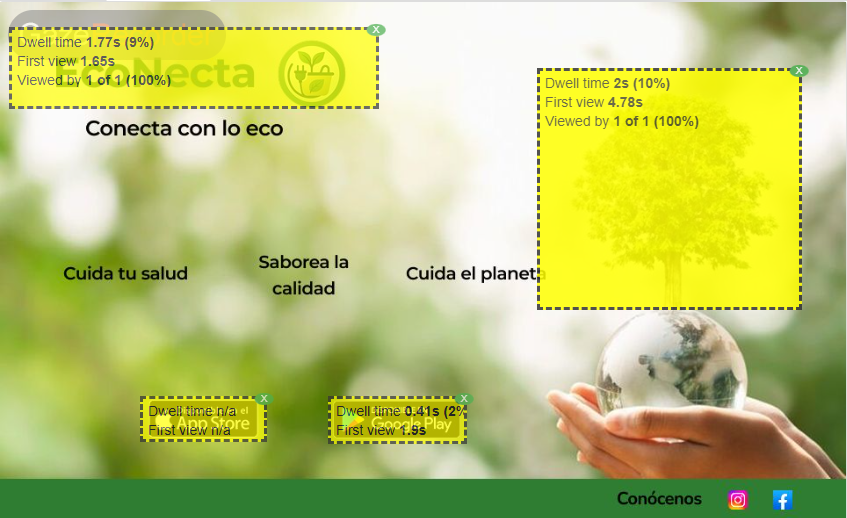

## Paso 4. Pruebas de Evaluación 

### 4.a Reclutamiento de usuarios 

-----

Vamos a analizar el trabajo de nuestros compañeros de grupo DIU1.JaviManuel. Su proyecto se llama [EcoNecta](https://github.com/javiruizz/UX_CaseStudy), que trata sobre una plataforma diseñada para quienes buscan un estilo de vida más sostenible y saludable. A través de su app, ofrecen acceso a productos ecológicos directamente de agricultores y ganadaros locales.

Inicialmente, nos ha llamado mucho la atención la aplicación de nuestros compañeros, por que su idea es muy parecida a la nuestra, enfocada en un estilo de vida ecologista.

Partiendo de esto, vamos a definir los dos casos el A y el B:

**CASO A:** El caso A hace referencia a nuestro proyecto de practicas, el cual será evalorado por nuestros compañeros de piso.
**CASO B:** El caso B hace referencia al proyecto de nuestros compañeroa de EcoNecta, el cual valoraremos nosostros mismos.

| Usuarios | Sexo/Edad     | Ocupación   |  Exp.TIC    | Personalidad | Plataforma | Caso | Real/Ficticio
| ------------- | -------- | ----------- | ----------- | -----------  | ---------- | ---- |--------------
| Ángela  | M / 21   | Enfermera en prácticas  | Medio       | Intensa | Windows / Web / Android       | A    | Real
| Alba  | M / 20   | Estudiante de Ingeniería de COmputadores  | Alta       | Independiente       | Linux / Windows / Web / Android        | A    | Real
| Samuel | H / 20   | Estudiante de Ingeniería informática     | Alta         | Emocional    | Linux / Windows / Web / Android      | B    | Real
| Vicky  | M / 25   | Desarrolladora de D365  | Alta       | Resolutiva     | Windows / Web / IOS        | B    | Real

### 4.b Diseño de las pruebas 
 
-----

Vamos a realizar distintas pruebas para valorar el diseño de las aplicaciones que hemos desarrollado:

- **Cuestionario SUS (System Usability Scale)**

Evaluaremos qué tan fácil y agradable ha sido usar la aplicación mediante un breve cuestionario de 10 preguntas. Cada usuario lo completará tras interactuar con uno de los diseños, y con sus respuestas obtendremos una puntuación de usabilidad.

- **A/B Testing**

Compararemos nuestra aplicación con la de nuestro compañero. Mediremos cuál permite realizar tareas clave de forma más rápida y clara. Compararemos los resultados para identificar el diseño más efectivo. Partiendo obviamente de que son implementaciones distintas para problemas distintos. En este punto valoraremos sobre todo la claridad y rápidez de uso, no que aplicación es mejor que la otra. 

- **Eye Tracking (Seguimiento Visual)**

Utilizando una herramienta como GazeRecorder, grabaremos cómo los usuarios exploran visualmente la interfaz. Esto nos ayudará a entender qué elementos llaman más la atención y si encuentran fácilmente lo que buscan.

### 4.c Cuestionario SUS
 
----

| Nº | Pregunta                                                                 | Ángela | Alba | Samuel | Vicky |
| -- | ------------------------------------------------------------------------ | - | - | - | - |
| 1  | Creo que me gustará visitar con frecuencia este website	                | 4 | 3 | 4 | 5 |
| 2  | Encontré el website innecesariamente complejo                        | 1 | 1 | 1 | 1 |
| 3  | Pensé que era fácil utilizar este website	                                | 5 | 5 | 5 | 4 |
| 4  | Creo que necesitaría del apoyo de un experto para recorrer el website      | 1 | 1 | 1 | 1 |
| 5  | Encontré las funciones del website bastante bien integradas                  | 5 | 5 | 4 | 5 |
| 6  | Pensé que había demasiada inconsistencia en el website             | 1 | 1 | 1 | 2 |
| 7  | Imagino que la mayoría de las personas aprenderían muy rápidamente a utilizar el website | 4 | 3 | 5 | 5 |
| 8  | Encontré el website muy grande al recorrerlo                             | 1 | 1 | 1 | 1 |
| 9  | Me sentí muy confiado en el manejo del website                                | 5 | 5 | 4 | 5 |
| 10 |Necesito aprender muchas cosas antes de manejarse en el website  | 1 | 1 | 1 | 1 |

---

**¿Cómo calculamos nuestra nota?**

Si no nos hemos dado cuenta al realizar el test, tenemos que fijarnos en que todas las preguntas pares buscan calificar positivamente el website, y las impares negativamente. Para evaluarlo, tenemos que sumar todas nuestras respuestas de la siguientes manera:

Las preguntas impares se puntúan como:  **nota - 1** Ej: Si hemos puntuado con un 5, tenemos que sumar al cómputo 5-1 = 4.
Las preguntas pares se puntúan como: **5 - nota** Ej: Si hemos puntuado con un 2, tenemos que sumar al cómputo un 5-2 = 3.

Si sumamos todos los puntajes podemos obtener un máximo de 40, por lo que multiplicamos por 2.5 el resultado de la suma, para calcular nuestra nota final sobre 100. Como ejemplo, vamos a calcular la nota de Samuel:

3 + 4 + 4 + 4 + 3 + 4 + 4 + 4 + 4 + 4 = 37. => 37 * 2.5 = 92.5

| Usuario   | Caso Evaluado | Fecha | Resultado SUS (puntaje) | Observaciones |
| --------- | ------------- | ----- | ----------------------- | ------------- |
| Ángela | A             | 28/05/2025 |           95              |               |
| Alba | A             | 28/05/2025 |            90             |               |
| Samuel | B             | 27/05/2025 |            92.5          | Por lo general el wireframe resulta muy intuitivo y es muy fácil de utilizar  |
| Vicky | B             | 27/05/2025 |             95         | EcoNatura tiene muy buenas funcionalidades con una facilidad de uso alta |

### 4.d A/B Testing
 
-----
Para realizar el test, hemos pensado en poner a prueba ambos wireframes, tanto el nuestro como el de nuestros compañeros a prueba. Vamos a ver cual de los dos diseños es más rapido e intuitivo a la hora de publicar un nuevo post. Es una mecánica que que nosotros tenemos incluido como publicar posts y ellos como vender nuevo producto, pero al final es lo mismo. Vamos a ver cual es más directo para lo que vamos a evaluar tres puntos:

1. Cuanto tiempo tarda en publicar un nuevo post
2. Cuantos click utiliza para ello
3. Número de errores o dudas. Entre las que contamos: Preguntas que se hagan para averiguar el funcionamiento, cliks de error al pensar que estaba la opción en un sitio donde no era etc

Vamos a poner a prueba a dos usuarios distintos sobre los dos wireframes, para tener una comparación más valida que si fuera uno solo. A continuación vamos a mostrar dos diagramas de acciones en el que se ven las distinas acciones que realizan cada usuario en cada uno, además de el tiempo entre ellas. Cabe recalcar que el primer usuario tenía un poco más de contexto sobre el funcionamiento y el tema de ambos WireFrames, pero el segundo era la primera vez que interactuaba con estos, por lo que es un ejemplo más realista a la hora de testear el primer contacto con la aplicación:

 

  

 

Las conclusiones que hemos sacado de este usuario es que es de un caracter "ansioso" lo que encaja con su definición de personalidad "intensa", es decir, en vez de quedarse leyendo o analizando las distintas opciones que se ofrecen en la pantalla, prefiere navegar sobre el WireFrame para entender su funcionamiento y sobre esto indagar y obtener la respuesta que buscaba. 

En el caso A no es tan obvio, lo primero que hace es scrollear hasta abajo del todo, después vuelve al principio y por último pulsa sobre la opción que buscábamos, todo ello en un plazo muy corto de tiempo. Los datos que sacamos es que ha tardado 2.5 segundos, se ha equivocado una vez al scrollear y ha completado la acción en un solo click.

En el caso B ha quedado más claro, primero pulsa en el carrito teniendo que volver hacia atrás. Después pulsa en la opción de ver nuestros productos y en el momento en el que se da cuenta de que se ha equivocado por segunda vez es cuando se para a pensar y analizar. En este punto encuentra la opción de "vender" llegando a nuestro destino. Los datos que sacamos es que ha tardado 5 segundos, se ha equivocado en dos ocasiones y ha tardado 4 clicks en total.

 

A continuación vamos a poner a prueba al segundo usuario:

 

  

 

El segundo usuario hemos comprobado que es bastante opuesto al primero. Mientras al primero no le gustaba perder tiempo e intentar hacer las acciones lo más rapido posible aun equivocandose, este usuario es mucho más calmado y se para a analizar la app por completo hasta encontrar la opción correcta. Ha completado ambos test en tan solo un click y sin fallos, siendo el primero en 3 segundos y el segundo en 6.

 

En conclusión ambas funcionalidades son bien accesibles, pues podemos llegar a ellas a través de un solo click de forma correcta. Sin embargo la primera resulta más intuitiva, ya que para ambos usuarios el tiempo, el número de click y de errores ha sido inferior. Que en el segundo wireframe esta opción esté en el footer y no en el centro de la pantalla como en la primera tiene mucho que ver. El footer suele ser información que tiene poca relevancia visual, y la opción de comprar comparte espacio con otras que no tienen mucha relevancia. Por lo tanto el primer wireframe gana en este caso.

### 4.e Aplicación del método Eye Tracking 

----

Para analizar esta parte hemos utilizado el software de GazeRecorder. El cual a través de un test de calibración con la cámara, ha captado nuestra visión para calcular los puntos de la pantalla en la que más enfocamos nuestra vista. Hemos evaluado la landing page de nuestro compañero a través de dos tipos de métricas:

- En la primera imagen podemos ver los mapas de calor de nuestra visión donde nos marca los puntos en los que más nos hemos fijado.
- La segunda imagen nos da unas métricas del porcentaje de tiempo que hemos estado mirando los distintos puntos de interés de la landing page.

 

  
  

 

 

  
  

 

Por lo general, consideramos que la lading page es muy correcta. Los enlaces de descarga han resultado elementos de los más llamativos a partir de los datos, que al final es nuestro objetivo como desarrolladores, llamar la atención del usuario para incitar su descarga. El único problema que hemos podido encontrar es que el primer usuario, ha estado mirando más tiempo la imagen de decoración de la derecha que cualquier otro elemento. Es posible que sea demasiado llamativo o que se lleve más atención de la necesaria.

### 4.f Usability Report de B
 
-----

El Usability report es un reporte final que hemos elaborado a nivel de sintésis y conslusión sobre las distintas pruebas que ya hemos realizado a los usuarios. Hay muchos aspectos de los que ya hemos hablado aquí, pero siempre está bien unificarlo y sacar conclusiones globales sobre los datos obtenidos. Aqui inserto el enlace a nuestro Usability Report:

 

 
