# DIU25
Prácticas Diseño Interfaces de Usuario (Tema: Reciclaje y artesanía (handcraft)) 

[Guiones de prácticas](GuionesPracticas/)

**Grupo:** DIU3.Pizza-con-Curry.  Curso: 2024/25 

Actualizado: 27/05/2025

**Proyecto:**

Tutoriales de **reciclado de ropa**.

**Enlace a la simulación de la Práctica 3:** [Enlace al prototipo](https://www.figma.com/proto/IB9CthJOS3Id6D8RaYn6hK/mockup_DIU3.Pizza-con-Curry?node-id=1-1180&t=KujEUOlOSzWLGRyH-1&scaling=scale-down&content-scaling=fixed&page-id=0%3A1)

**Descripción:** 

Nuestra propuesta de valor se basa en añadir esta nueva funcionalidad a la página, incluyendo un sistema de posts para que los usuarios puedan publicar sus propios tutoriales de reciclaje de ropa y, a su vez, consultar los tutoriales publicados por el resto.

El hilo de conversación sobre estos posts obviamente girará en torno a la ropa reciclada, y derivados de este. Además de compartir alguna experiencia personal, compartir tips sobre un estilo de vida reciclable etc. La imaginación es infinita, y los usuarios tendrán total libertad en este aspecto.

**Logotipo:** 

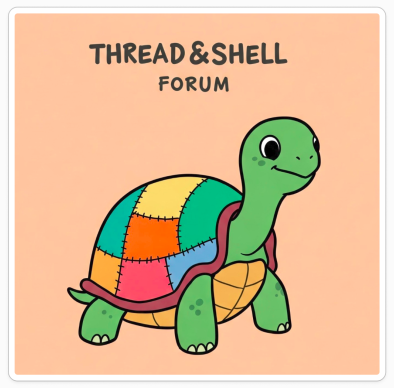

Miembros:
 * :bust_in_silhouette:  [Samuel Sánchez Cantero](https://github.com/Zapi24)     :octocat:   
 
 * :bust_in_silhouette:  [Victoria Dueñas Salcedo](https://github.com/vduesal)     :octocat:   

----- 

# Proceso de Diseño 

## Paso 1. UX User & Desk Research & Analisis 

### 1.a User Reseach Plan
 
-----

La plataforma que vamos a analizar es la tienda de ropa de segunda mano *Moda re-*, la cual fomenta el uso sostenible de la ropa, dándole una segunda vida en tiendas locales a nivel nacional. Con este plan de investigación, vamos a localizar aquellas posibles taras que dificultan la experiencia que pueda tener el usuario sobre esta, con el objetivo siempre de proponer mejoras y sugerir nuevas funcionalidades que mejoren esta experiencia.

Taras: 
- **Sobrecarga de información**: la web no sigue la conocida “regla de los tres clics”. Esta regla consiste en que para hacer alguna operación en la página, al tener algunas funcionalidades demasiado rebuscadas, tenemos que indagar más de lo necesario en esta. Esto incluye la calidad del contenido y la desestructuración de la web. También afecta negativamente a la promoción de las ventas.
- **Limitación geográfica**: al ser una página web de ropa, nos pueden dar la falsa idea, así como la posibilidad de comprar por internet. Sin embargo, en ningún momento nos especifica que esta funcionalidad no está implementada, sino que solo ofrece opciones de compra en tiendas físicas locales, lo que reduce mucho su alcance.
- **No va a lo importante**: el objetivo final de las empresas de ropa es promocionar sus ventas. Por esta razón, nada más entrar a la página web, lo primero que se nos debería mostrar es la información correspondiente a las compras. Desconocemos el objetivo principal de la empresa, ya que nos lo ofrece como el reciclaje de la ropa, mientras que este debería ser el objetivo secundario que va ligado a la compra de ropa de segunda mano y reciclada.
- **Problema con la interfaz**: se han querido añadir tantos “efectos” y “transiciones” de imágenes e información que a veces no es fácil interactuar con la web. La entrada a esta página es complicada, una persona que no tenga mucha soltura con las tecnologías, puede no llegar a entenderla e interactuar con esta fácilmente. También resulta difícil identificar, con qué elementos de la página, podemos interactuar realmente, y con cuáles no. Además, si nos damos cuenta, la información relevante pasa a un segundo plano, llamando mucho más la atención las imágenes y los efectos visuales que la información que nos quiere llegar a ofrecer.

Propuestas de mejora y nuevas funcionalidades:
- **Simplificar la navegación y hacerla más intuitiva**: la web necesita una estructura mucho más clara y sencilla, donde los usuarios encuentren lo que buscan de forma directa. Podría mejorarse con la implementación de una barra de búsqueda visible nada más entrar en la web que muestre las distintas funcionalidades que puede ofrecer. Una interfaz limpia con botones claros y fáciles de usar haría que cualquier persona pueda utilizar la web sin problemas.
- **Tienda online**: actualmente la web da la impresión de que se puede comprar online, pero no es así. Se podría implementar una tienda online, priorizando las ventas, aunque puede que no sea viable para la economía de la empresa. Debería informarse al usuario de que esta funcionalidad no existe, proporcionando la ubicación de las tiendas físicas de forma más directa.
- **Priorizar las ventas**: la página web, debe enfocarse en promocionar los productos y ofertas desde el primer momento. El reciclaje y la sostenibilidad, son señales de identidad para la empresa, pero es un complemento asociado a su producto de venta, que es la ropa de segunda mano.
- **Añadir funcionalidad a la empresa**: podríamos incluir una sección de tutoriales para reutilizar prendas viejas, pudiendo ser posibles productos para la empresa, reforzando la imagen sostenible de la empresa.

### 1.b Competitive Analysis
 
-----

La plataforma que hemos elegido para analizar es *Moda re-*, la cual es un proyecto de inclusión social que gestiona ropa usada, genera puestos de empleo para personas en riesgo de exclusión y fomenta la economía circular. Posee una red de tiendas textiles locales repartidas por todo el territorio nacional, en las cuales puedes donar ropa que ya no utilices para darle una segunda vida.

### 1.c Personas
 
-----

A la hora de analizar las diferentes situaciones problemáticas que pueden surgir a la hora de acceder a [Moda re-](https://modare.org/), hemos generado dos perfiles ficticios (Amparo y Jorge).

Las siguientes dos personas tienen interés por los servicios que ofrece Mora re-. Aparentemente, son perfiles de personas muy diferentes, tanto en raíces como en conocimiento, recursos y estilo de vida. Aún así, se ven relacionados en el hecho de que Amparo quiere buscar como poder darle una segunda vida a ropa que tiene acumulada, y Jorge quiere comprar ropa de segunda mano online.

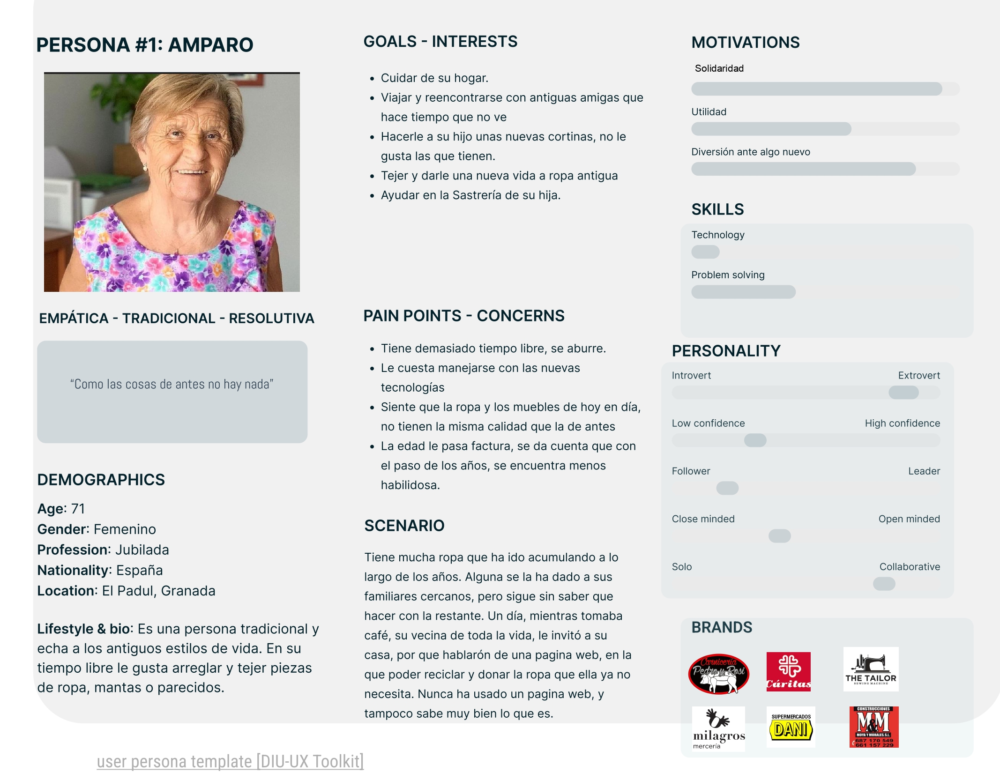

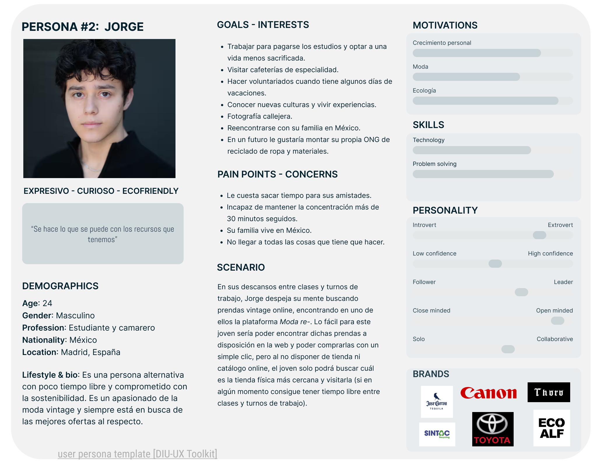

### 1.d User Journey Map
 
----

Escogemos dos experiencias de usuario que hacen uso de las funcionalidades de la plataforma para poder saber cuales son sus puntos débiles.

La aspiración de Amparo es poder encontrar un uso que darle a toda esa ropa guardada que tiene en casa.

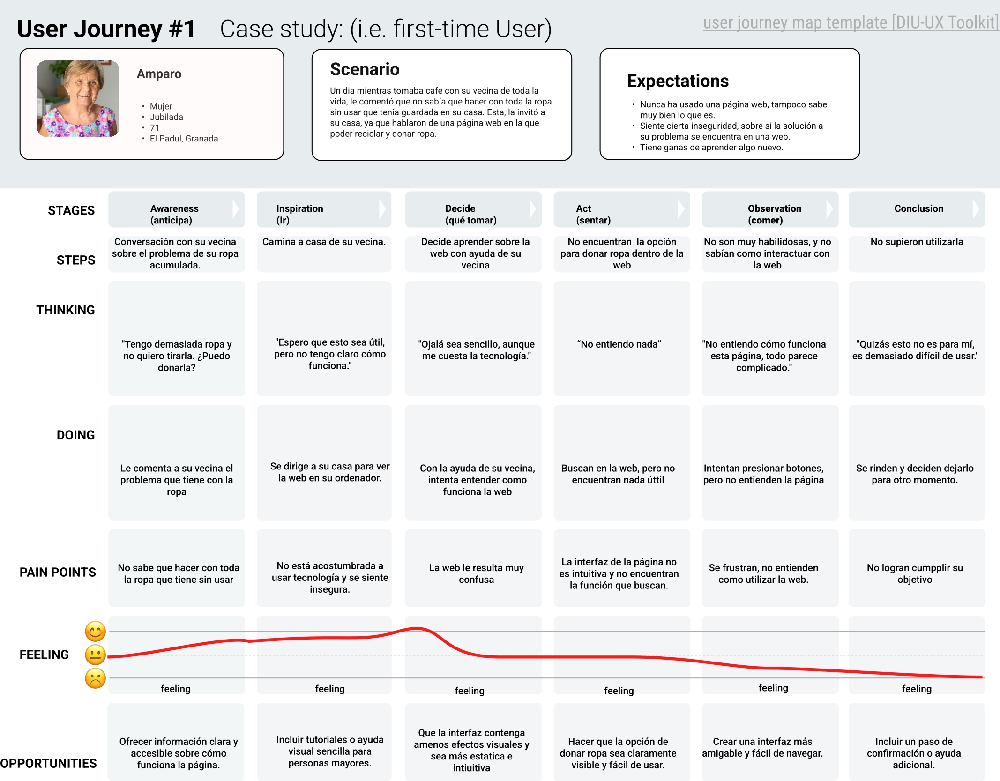

Jorge está intentando buscar nuevas webs de ropa de segunda mano, y es ahí cuando se encuentra con *Moda re-* y decide acceder para ver las prendas que oferta este sitio.

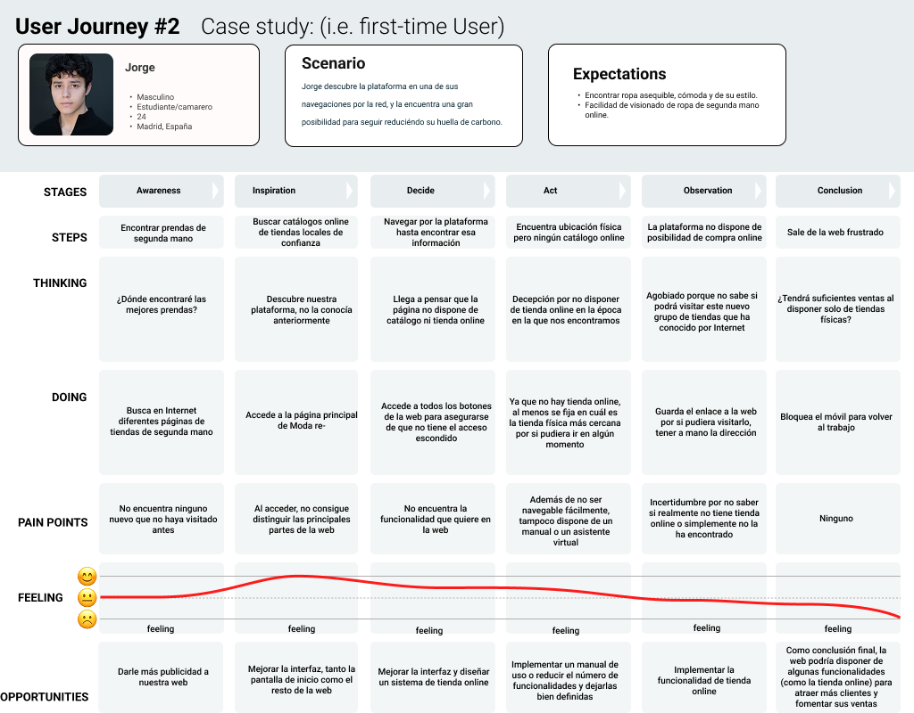

### 1.e Usability Review
 
----

Tras hacer una revisión de usabilidad de la web de *Moda re-* a fondo, encontramos sus puntos fuertes y débiles.

- Enlace al documento: [plantilla](P1/Usability-review-Modare.pdf)
- URL y Valoración numérica obtenida: 60/100
- Comentario sobre la revisión: Tras haber encontrado los puntos fuertes y débiles de la página web hemos podido llegar a distintas conclusiones. Por lo general, es una web que tiene un correcto funcionamiento, hace lo esperado, sin embargo, esto no implica que esté bien diseñada. La interfaz para nosotros, es el mayor problema. Es introducirte en la web, y te saturas de imágenes, transiciones y efectos visuales, alejando la puerta de entrada y confundiendo a los usuarios. No se sabe muy bien con qué elementos se pueden interactuar, y con cuáles no. Además, las funcionalidades que nos ofrecen, están muy limitadas, como ya hemos comentado dentro del punto "1a", pues no ofrece las posibilidades, que te puedes esperar de primeras de una web de ropa de segunda mano.

 

## Paso 2. UX Design  

### 2.a IDEACION: Feedback Capture Grid 
 
----

Tras haber terminado la práctica 1, hemos llegado a diversas conclusiones respecto a la web *Moda re-*. Para expresarlas, hemos creado una malla receptora con distintos campos de información. 
 
**1. Worked:** Puntos positivos que hemos encontrado sobre la web.
 
**2. Change:** Problemas claros a nivel de usabilidad.
 
**3. Questions:** Preguntas que un usuario puede llegar a preguntarse nada más entrar a la página.
 
**4. Ideas:** Distintas propuestas de mejora.

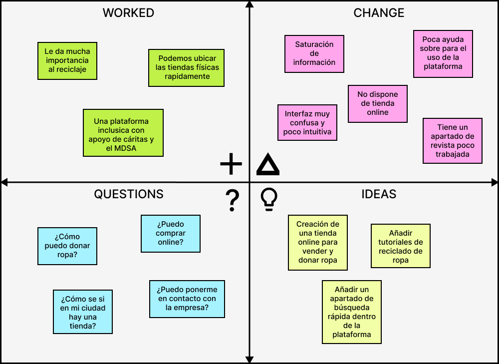

### 2.b ScopeCanvas

----

Tras haber analizado el diseño de la página web actual, hemos encontrado que una de las principales mejoras que podemos implementar, es el añadir una especie de foro, donde los distintos usuarios de forma pública, pueden añadir posts. El hilo de conversación sobre estos posts obviamente, girarán en torno a la ropa reciclada, y derivados de este. Además de compartir alguna experiencia personal, compartir tips sobre un estilo de vida reciclable etc. La imaginación es infinita, y los usuarios tendrán total libertad en este aspecto.

Aun así, esta libertad no puede ser total. Si cualquier usuario puede escribir lo que quiera, la página no tardará en llenarse de posts que no tengan nada que ver sobre el tema principal. Para ello, se tendrán varios filtros para controlar este hilo de posts:

1. Los propios usuarios, podrán valorar con un sistema interno de "felicidad" basado en tortugas. Si les gusta, y están de acuerdo con este, sumarán en uno, el contador de tortugas sanas y felices. Si no están de acuerdo, sumarán en uno, el contador de tortugas tristes y difuntas :(

2. Habrá un tipo de usuario, denominado, "usuario admin", el cual tiene poder sobre los post ajenos, pudiendo eliminar alguno de ellos, si lo considera ofensivo.

3. Habrá a su vez un filtro automático por código, el cual no dejará publicar posts que detecte que contenga palabras palabras malsonantes. 

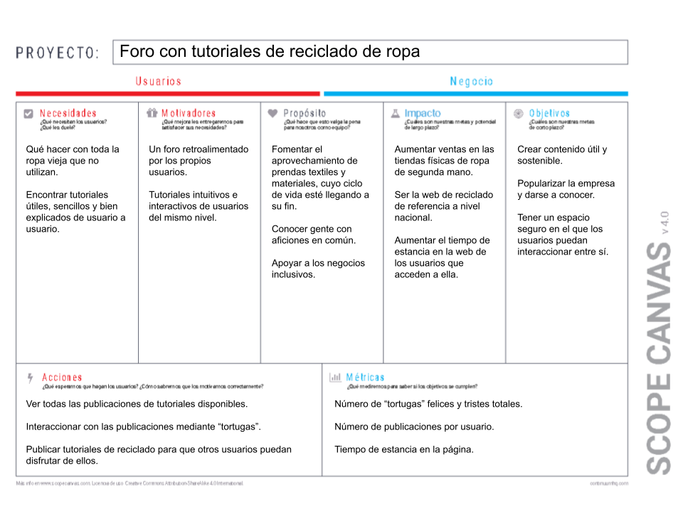

### 2.b User Flow (task) analysis 
 
-----

Hemos diseñado los pasos a seguir para 3 de las acciones que podrán realizar los usuarios que interactúen con nuestra propuesta de funcionalidad.

- Añadir una nueva publicación:

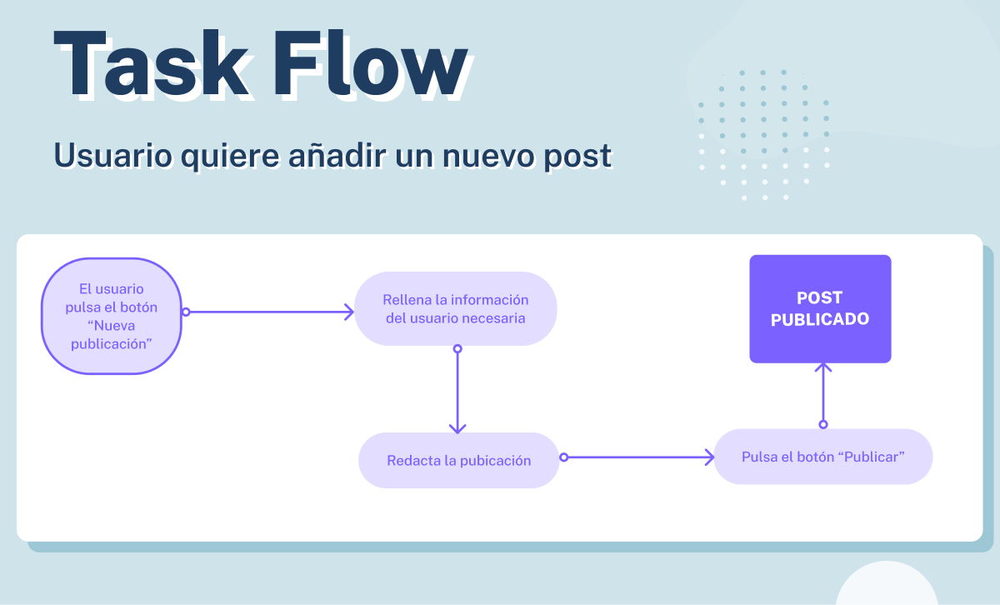

- Ver las publicaciones de los demás:

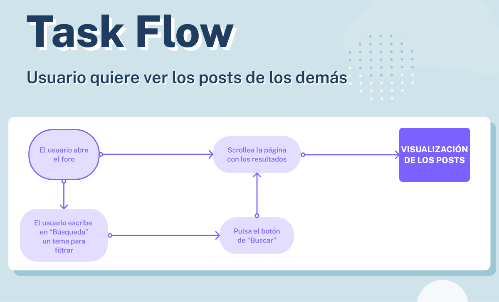

### 2.c IA: Sitemap + Labelling 
 
----

#### SiteMap (Mapa de sitio)
Es una representación estructurada de las páginas y contenido dentro de un sitio web o aplicación. Sirve como una guía para entender la organización y la jerarquía de la información. Vamos a definir la navegabilidad y la indexación de nuestra plataforma, beneficiando la experiencia de los usuarios.
  
El Sitemap de nuestra implementación es realmente básico, ya que al acceder al foro todo girará en torno al carrusel vertical de las publicaciones. Las distintas ventanas que aparecen, como la lateral o la de publicación de un nuevo post, son ventanas emergentes, que se muestran encima de la original. Partiendo de esto, llegamos a la siguiente estructura: 

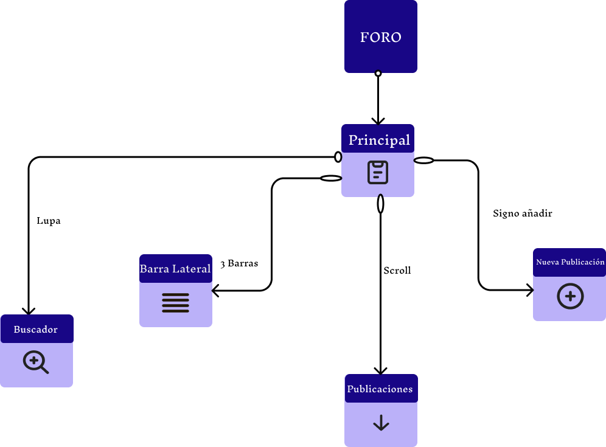

#### Labelling
El proceso de asignar nombres claros y descriptivos a los elementos de una interfaz de usuario, como menús, botones y enlaces. Su objetivo es mejorar la usabilidad y la comprensión del usuario al proporcionar indicaciones precisas y coherentes sobre la función de cada elemento.

   
| Término         | Significado                                                             |
| -------------- | ---------------------------------------------------------------------- |
| FORO           | Ingresamos a la implementación                                       |
| Principal      | Pantalla principal que nos aparece al ingresar                       |
| Ver Publicación  | Ventana para ver el post desde más cerca.             |
| Nueva Publicación | Ventana emergente que nos permite añadir un post.                  |
| Barra Lateral  | Menú desplegable, para ordenar y ver marcadores globales de tortugas. |
| Buscador       | Ingresamos texto para filtrar los posts.                             |

### 2.d Wireframes
 
-----

  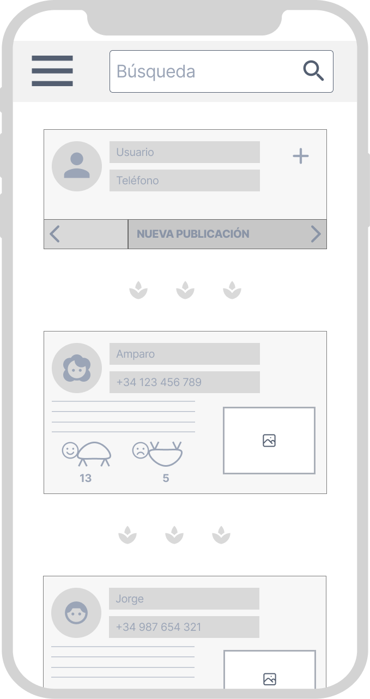

 

**Pantalla de inicio:**  
Interfaz de inicio, con la cual podemos navegar a través del foro. Si pulsamos en la primera publicación, que es una publicación vacía, podemos añadir una nueva publicación. Si utilizamos el buscador podemos filtrar por palabras para buscar algo en concreto. Podemos pulsar en las 3 líneas para abrir la barra lateral. Y por último y más importante, podemos scrollear hacia abajo, para ver los demás post del foro, pudiendo pulsar en ellos para verlos desde más cerca.

---

  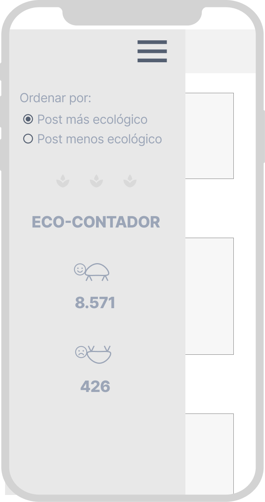

 

**Ordenación de publicaciones y contador global de interacciones (barra lateral):**  
Al pulsar en las 3 líneas accedemos a la barra lateral, y pulsándolas de nuevo, salimos de esta. Dentro de esta barra podemos ordenar los posts por “post más ecológicos” o “menos ecológicos”, es decir, ordenar los post por mayor número de tortugas felices o tristes en todo el foro. Además de un marcador global donde se ven estas estadísticas.

---

  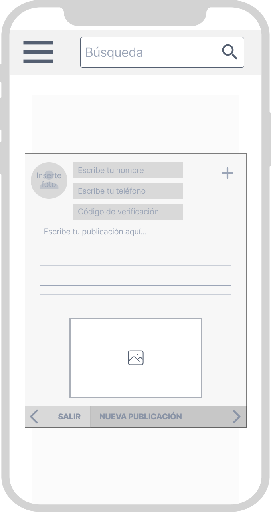

 

**Publicar un post:**  
Al pulsar en la primera publicación (vacía) nos aparece una ventana emergente sobre el foro, donde podemos añadir una nueva publicación a este. Debemos completar los campos obligatorios de identificación, y completar el post a nuestro gusto, pudiendo añadir multimedia. Podemos volver atrás si no queremos publicar nada, o terminar de publicar nuestro post.

---

  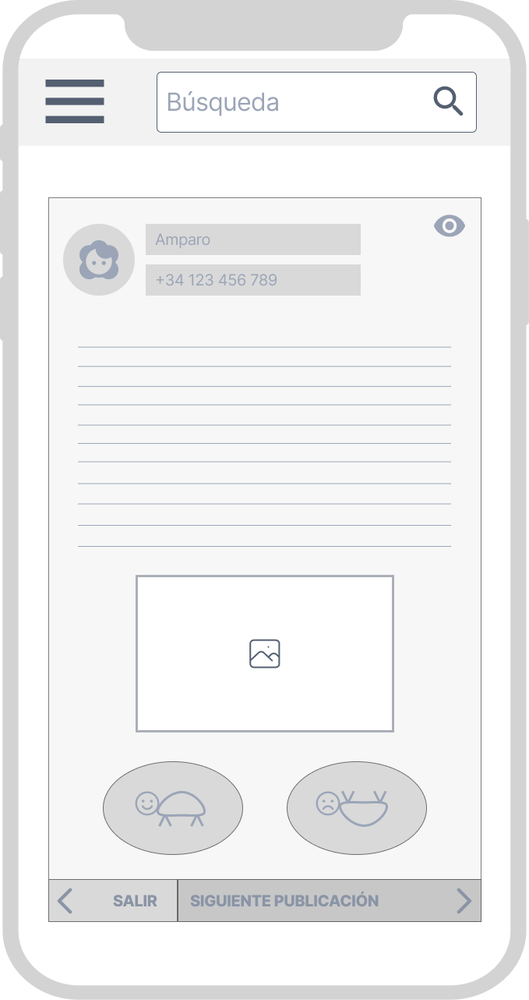

 

**Visualizar e interaccionar con una publicación:**  
Al pulsar en una de las publicaciones ya existentes en el foro nos aparece una ventana emergente en la que podemos ver la publicación actual completa, con sus archivos adjuntos, y en la que podemos interaccionar mediante las tortugas en función de si nos gusta más o menos la publicación. Podemos volver atrás cuando queramos volver a la pantalla de inicio del foro, o podemos pasar a la siguiente publicación para seguir interaccionando con ellas.

---

 

### Conclusión sobre la P2:

Una de las valoraciones más positivas que sacamos de esta práctica es el enfoque imaginativo que se nos propone a la hora de recrear e implementar una nueva funcionalidad a nivel de diseño. Quisimos darle un toque de humor con el sistema de tortugas tristes y felices, enfocando la idea principal de valoraciones de los posts en esto, para aportar originalidad a nuestro sistema de publicación.

A su vez, el diseño en Figma de la interfaz fue tedioso por momentos, especialmente al intentar estructurar cada elemento en su lugar. Sin embargo, lo más satisfactorio fue ver el proyecto terminado, con todos los bocetos y esquemas bien definidos.

A modo de anécdota, hubo un momento curioso durante el desarrollo. Cuando ya teníamos diseñado el sistema para la web, incluimos un botón para añadir una nueva publicación, pero se nos pasó por completo poner uno para guardar y publicar el post.

Como conclusión, hemos aprendido muchas ideas de diseño durante esta práctica, las cuales podremos aplicar en la creación de aplicaciones o páginas web en el futuro.

 

## Paso 3. Mi UX-Case Study (diseño)

El nombre que hemos elegido es: **Thread&Shell**

Hemos intentado unificar la idea principal de nuestro proyecto, que es el de un foro de posts sobre el que ir scrolleando, por eso el término de **Thread** (hilo de posts) con el tema principal de nuestra página, la ecología, por eso hacemos referencia al caparazon de las tortugas, elemento que sale a lo largo de la página **Shell**.

**Enlace a la simulación de la Práctica 3:** [Enlace al prototipo](https://www.figma.com/proto/IB9CthJOS3Id6D8RaYn6hK/mockup_DIU3.Pizza-con-Curry?node-id=1-1180&t=KujEUOlOSzWLGRyH-1&scaling=scale-down&content-scaling=fixed&page-id=0%3A1)
 **Enlace a un tutorial de nuestra app:** [Tutorial Thread&Shell](https://github.com/DIU3-Pizza-con-Curry/UX_CaseStudy/blob/master/P3/tutorial_thread%26shell.mp4)

### 3.a Moodboard

-----

Para el diseño visual de nuestra aplicación "Thread&Shell", hemos diseñado un Moodboard en el que hemos plasmado los patrones y características de diseño que tiene una aplicación. Dentro de nuestro Moodboard hemos añadido lo siguiente:

- **Nuestra estrategia de marca:** para marcar los puntos de nuestra visión a la hora de enfocar la aplicación, estableciendo así el nombre definitivo de nuestra página.
- **Estilo de nuestro logo:** hemos creado una imagen utilizando inteligencia artificial de una tortuga para utilizarla como logo. Nuestra idea es que las tortugas sean nuestra seña de identidad, pues es un elemento que utilizamos constantemente.
  
 

  

 

- **Nuestro branding:** establecemos un eslogan como empresa, buscando atraer a un público ecologista y de bienestar con el juego de palabras de "Thread Shell = Tortugas felices".
- **Paleta de colores:** utilizamos distintos tonos de verde, que son colores que nos acercan a la naturaleza.
  
 

  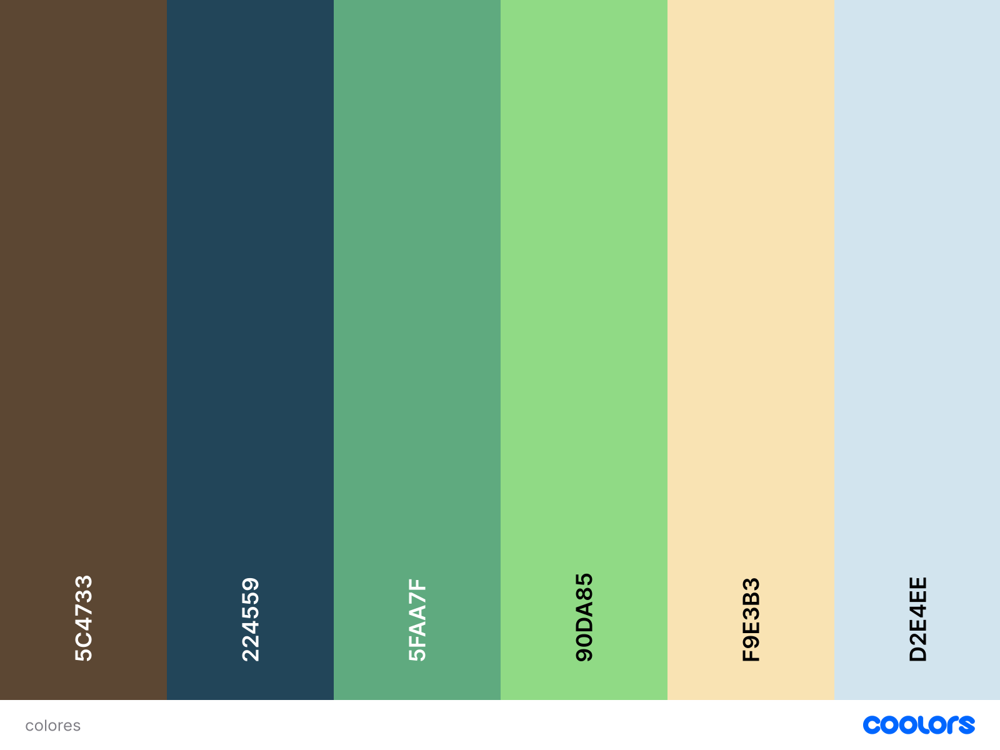

 

- **Tipografia:** utilizamos letras con un estilo minimalista, que sean fáciles de leer en dispositivos pequeños.
- **Imágenes:**  hemos insertado una serie de imágenes, entre las que encontramos las tortugas felices/tristes y distintos iconos que indican funcionalidades dentro de nuestra aplicación.

Hemos añadido mensajes de inspiración basados en posibles usuarios además de imágenes que hemos utilizado como inspiración de estilo para forjar el nuestro propio.

 

  

 

### 3.b Landing Page
 
----

Para la Landing Page, no buscabamos una vista demasiado llamativa, mas bien lo contrario, que fuera simple directa y que se entendiese rapido el mensaje. En esta como carta de presentada, escribimos varios mensajes llamativos e incentivos al usuario, para que se interese por descargar nuestro foro, planteando ya desde primeras el tono ecologista que caracteriza a nuestra aplicacion. También mostramos nuestro logo, que es nuestra seña de identidad en varios puntos, como en el fondo de la landing page, abarcando esta, y en el header. Sin olvidar, que la función principa de esta, es que el usuario se interese e instale nuestra app, siendo este botón el más llamativo y accesible de esta página.

 

  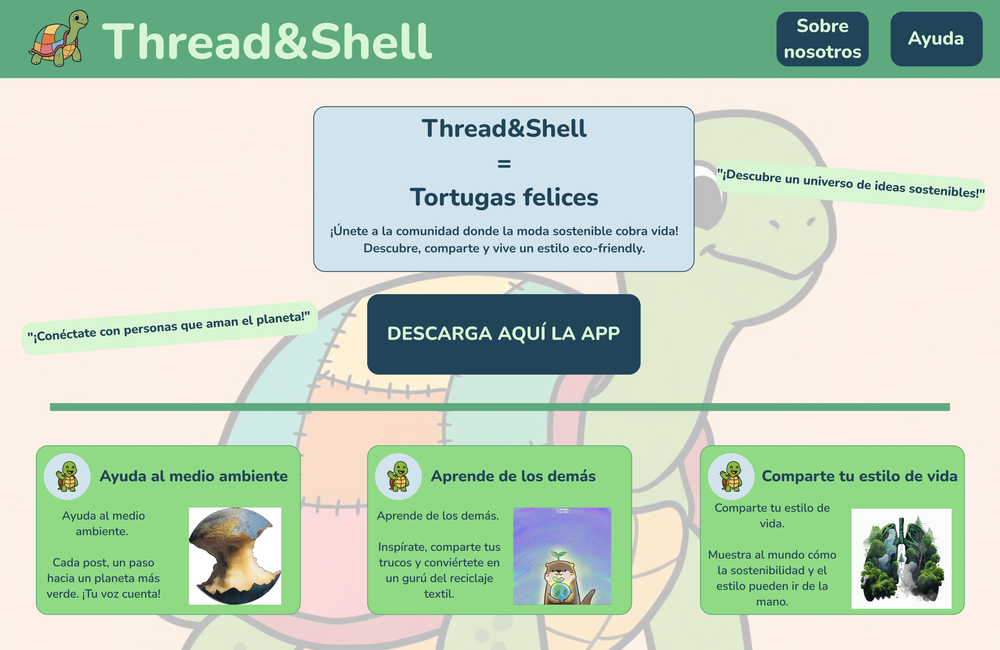

 

### 3.c Guidelines
 
----

Nos hemos estado documentando en UI Patterns para definir los siguientes patrones de diseño que hemos implementado en nuestro foro de publicaciones. Estos patrones garantizan una experiencia de usuario clara, intuitiva y coherente durante su uso.

**Navegación y Contenido:**

- **1. NavBar**: Hemos planteado una navegación clara en la parte superior. Nos permite abrir rápidamente la barra lateral o realizar búsquedas en el foro en cualquier momento.

- **2. Search**: Tenemos una barra de búsqueda visible y funcional que nos permite escribir para encontrar publicaciones específicas mediante palabras clave o usuarios.

- **3. Infinite Scroll**: El contenido se va cargando a medida que el usuario va haciendo scroll en la página principal.

- **4. Feed/List View (Cards)**: Las publicaciones se ven como tarjetas verticales que están ordenadas cronológicamente o por relevancia. Este formato mejora la legibilidad y separa claramente los posts entre sí.

- **5. Modal View**: Al pulsar sobre la primera publicación que nos permite añadir un nuevo post, se abre una ventana emergente que permite escribir la información necesaria para publicarlo o simplemente volver hacia atrás.

- **6. Lateral Menu**: Barra lateral desplegable que permite ordenar el contenido por criterios como “Más valorados” o “Menos valorados”, adaptando el foro a las preferencias del usuario.

**Interacción y Acciones de Usuario**

- **7. Like / Dislike Buttons**: Botones accesibles para valorar las publicaciones de forma rápida. Aumentan la interacción con el usuario y ayudan a destacar el contenido relevante.

- **8. Quick Post Form**: Contamos con un "formulario" rápido y accesible que nos permite escribir nuevas publicaciones ingresando pocos campos de texto, solo los imprescindibles.

- **9. Item Details + Actions**: Obtenemos una vista más detallada sobre cada publicación al interactuar con ella.

**Comunicación y Retroalimentación**

- **10. Toasts / Snackbars**: Mensajes breves, ya sean visuales o de texto, que confirman acciones importantes como publicar, dar like o dislike.

### 3.d Mockup
 
----

**Enlace a la simulación de la Práctica 3:** [Enlace al prototipo](https://www.figma.com/proto/IB9CthJOS3Id6D8RaYn6hK/mockup_DIU3.Pizza-con-Curry?node-id=1-1180&t=KujEUOlOSzWLGRyH-1&scaling=scale-down&content-scaling=fixed&page-id=0%3A1)
 **Enlace a un tutorial de nuestra app:** [Tutorial Thread&Shell](https://github.com/DIU3-Pizza-con-Curry/UX_CaseStudy/blob/master/P3/tutorial_thread%26shell.mp4)

**Cargar web:**
 

  

 

**Pantalla de inicio:**
 

  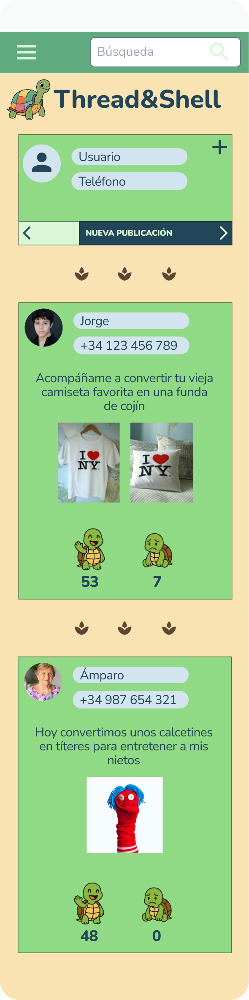
  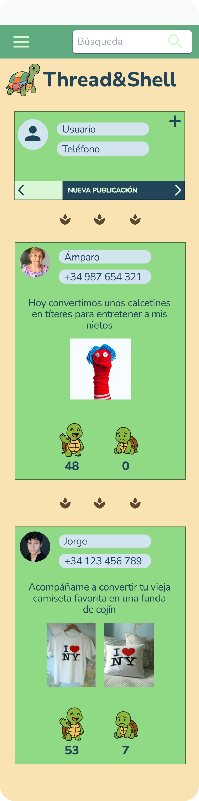

 

**Filtro:**
 

  
  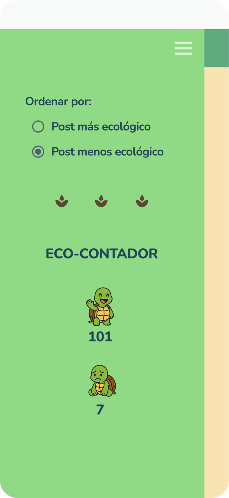

 

**Nueva publicación:**
 

  
  

 

**Publicación Amparo:**
 

  
  
  

 

**Publicación Jorge:**
 

  
  
  

 

### 3.e ¿My UX-Case Study?
 
-----

Para que el funcionamiento de el diseño en Figma de nuestro foro quede claro, hemos añadido un video a modo de tutorial, en el que mostramos de que manera podemos interactuar con el:

**Enlace a la simulación de la Práctica 3:** [Enlace a Figma](https://www.figma.com/design/IB9CthJOS3Id6D8RaYn6hK/mockup_DIU3.Pizza-con-Curry?node-id=1-1177&t=G2DJpqDr0hCOBTWi-0)
 **Enlace a un tutorial de nuestra app:** [Tutorial Thread&Shell](https://github.com/DIU3-Pizza-con-Curry/UX_CaseStudy/blob/master/P3/tutorial_thread%26shell.mp4)

 

### 3.f Conclusiones

Con este trabajo y sobre todo con nuestra aplicación Thread&Shell, hemos buscado crear un espacio en línea donde la conversación sobre moda reciclada fluya de manteral natural y sea agradable para los distintos tipos de usuarios. Este proyecto ha echo que aprendamos como aplicar principios de diseño UX para desarollar una plataraforma, que esperemos que sea inuitiva, atractiva y sobre todo disfrutona. Tan drisfutona como nosotros hemos disfrutado haciendola.

 

## Paso 4. Pruebas de Evaluación 

### 4.a Reclutamiento de usuarios 

-----

Vamos a analizar el trabajo de nuestros compañeros de grupo DIU1.JaviManuel. Su proyecto se llama [EcoNecta](https://github.com/javiruizz/UX_CaseStudy), que trata sobre una plataforma diseñada para quienes buscan un estilo de vida más sostenible y saludable. A través de su app, ofrecen acceso a productos ecológicos directamente de agricultores y ganadaros locales.

Inicialmente, nos ha llamado mucho la atención la aplicación de nuestros compañeros, por que su idea es muy parecida a la nuestra, enfocada en un estilo de vida ecologista.

Partiendo de esto, vamos a definir los dos casos el A y el B:

**CASO A:** El caso A hace referencia a nuestro proyecto de practicas, el cual será evalorado por nuestros compañeros de piso.
**CASO B:** El caso B hace referencia al proyecto de nuestros compañeroa de EcoNecta, el cual valoraremos nosostros mismos.

| Usuarios | Sexo/Edad     | Ocupación   |  Exp.TIC    | Personalidad | Plataforma | Caso | Real/Ficticio
| ------------- | -------- | ----------- | ----------- | -----------  | ---------- | ---- |--------------
| Ángela  | M / 21   | Enfermera en prácticas  | Medio       | Intensa | Windows / Web / Android       | A    | Real
| Alba  | M / 20   | Estudiante de Ingeniería de COmputadores  | Alta       | Independiente       | Linux / Windows / Web / Android        | A    | Real
| Samuel | H / 20   | Estudiante de Ingeniería informática     | Alta         | Emocional    | Linux / Windows / Web / Android      | B    | Real
| Vicky  | M / 25   | Desarrolladora de D365  | Alta       | Resolutiva     | Windows / Web / IOS        | B    | Real

### 4.b Diseño de las pruebas 
 
-----

Vamos a realizar distintas pruebas para valorar el diseño de las aplicaciones que hemos desarrollado:

- **Cuestionario SUS (System Usability Scale)**

Evaluaremos qué tan fácil y agradable ha sido usar la aplicación mediante un breve cuestionario de 10 preguntas. Cada usuario lo completará tras interactuar con uno de los diseños, y con sus respuestas obtendremos una puntuación de usabilidad.

- **A/B Testing**

Compararemos nuestra aplicación con la de nuestro compañero. Mediremos cuál permite realizar tareas clave de forma más rápida y clara. Compararemos los resultados para identificar el diseño más efectivo. Partiendo obviamente de que son implementaciones distintas para problemas distintos. En este punto valoraremos sobre todo la claridad y rápidez de uso, no que aplicación es mejor que la otra. 

- **Eye Tracking (Seguimiento Visual)**

Utilizando una herramienta como GazeRecorder, grabaremos cómo los usuarios exploran visualmente la interfaz. Esto nos ayudará a entender qué elementos llaman más la atención y si encuentran fácilmente lo que buscan.

### 4.c Cuestionario SUS
 
----

| Nº | Pregunta                                                                 | Ángela | Alba | Samuel | Vicky |
| -- | ------------------------------------------------------------------------ | - | - | - | - |
| 1  | Creo que me gustará visitar con frecuencia este website	                | 4 | 3 | 4 | 5 |
| 2  | Encontré el website innecesariamente complejo                        | 1 | 1 | 1 | 1 |
| 3  | Pensé que era fácil utilizar este website	                                | 5 | 5 | 5 | 4 |
| 4  | Creo que necesitaría del apoyo de un experto para recorrer el website      | 1 | 1 | 1 | 1 |
| 5  | Encontré las funciones del website bastante bien integradas                  | 5 | 5 | 4 | 5 |
| 6  | Pensé que había demasiada inconsistencia en el website             | 1 | 1 | 1 | 2 |
| 7  | Imagino que la mayoría de las personas aprenderían muy rápidamente a utilizar el website | 4 | 3 | 5 | 5 |
| 8  | Encontré el website muy grande al recorrerlo                             | 1 | 1 | 1 | 1 |
| 9  | Me sentí muy confiado en el manejo del website                                | 5 | 5 | 4 | 5 |
| 10 |Necesito aprender muchas cosas antes de manejarse en el website  | 1 | 1 | 1 | 1 |

---

**¿Cómo calculamos nuestra nota?**

Si no nos hemos dado cuenta al realizar el test, tenemos que fijarnos en que todas las preguntas pares buscan calificar positivamente el website, y las impares negativamente. Para evaluarlo, tenemos que sumar todas nuestras respuestas de la siguientes manera:

Las preguntas impares se puntúan como:  **nota - 1** Ej: Si hemos puntuado con un 5, tenemos que sumar al cómputo 5-1 = 4.
Las preguntas pares se puntúan como: **5 - nota** Ej: Si hemos puntuado con un 2, tenemos que sumar al cómputo un 5-2 = 3.

Si sumamos todos los puntajes podemos obtener un máximo de 40, por lo que multiplicamos por 2.5 el resultado de la suma, para calcular nuestra nota final sobre 100. Como ejemplo, vamos a calcular la nota de Samuel:

3 + 4 + 4 + 4 + 3 + 4 + 4 + 4 + 4 + 4 = 37. => 37 * 2.5 = 92.5

| Usuario   | Caso Evaluado | Fecha | Resultado SUS (puntaje) | Observaciones |
| --------- | ------------- | ----- | ----------------------- | ------------- |
| Usuario 1 | A             | 28/05/2025 |                         |               |
| Usuario 2 | A             | 28/05/2025 |                         |               |
| Samuel | B             | 27/05/2025 |            92.5          | Por lo general el wireframe resulta muy intuitivo y es muy fácil de utilizar  |
| Vicky | B             | 27/05/2025 |             95         |               |

### 4.d A/B Testing
 
-----
Para realizar el test, hemos pensado en poner a prueba ambos wireframes, tanto el nuestro como el de nuestros compañeros a prueba. Vamos a ver cual de los dos diseños es más rapido e intuitivo a la hora de plubliar un nuevo post. Es una mecánica que que nosotros tenemos incluido como publicar posts y ellos como vender nuevo producto, pero al final es lo mismo. Vamos a ver cual es más directo para lo que vamos a evaluar tres puntos:

1. Cuanto tiempo tarda en publicar un nuevo posts
2. Cuantos click utiliza para ello
3. Número de errores o dudas. Entre lsa que contamos: Preguntas que se hagan para averiguar el funcionamiento, cliks de error al pensar que estaba la opción en un sitio donde no era etc

Vamos a poner a prueba a dos usuarios distintos sobre los dos wireframes, para tener una comparación más valida que si fuera uno solo: 

### 4.e Aplicación del método Eye Tracking 

----

Para analizar esta parte hemos utilizado el software de GazeRecorder. El cual a través de un test de calibración con la cámara, ha captado nuestra visión para calcular los puntos de la pantalla en la que más enfocamos nuestra vista. Hemos evaluado la landing page de nuestro compañero a través de dos tipos de métricas:

- En la primera imagen podemos ver los mapas de calor de nuestra visión donde nos marca los puntos en los que más nos hemos fijado.
- La segunda imagen nos da unas métricas del porcentaje de tiempo que hemos estado mirando los distintos puntos de interés de la landing page.

 

  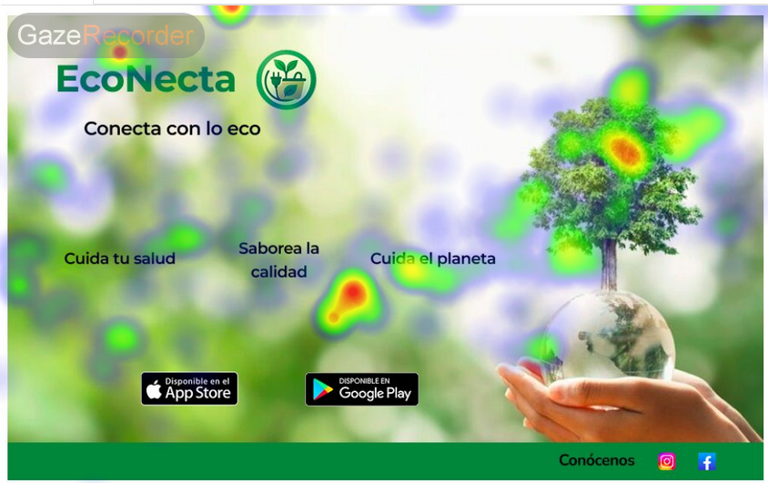
  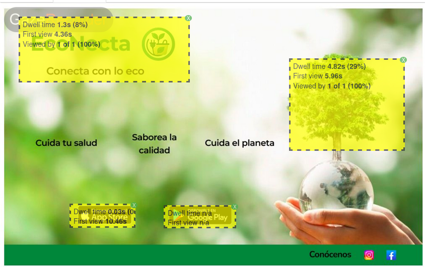

 

 

  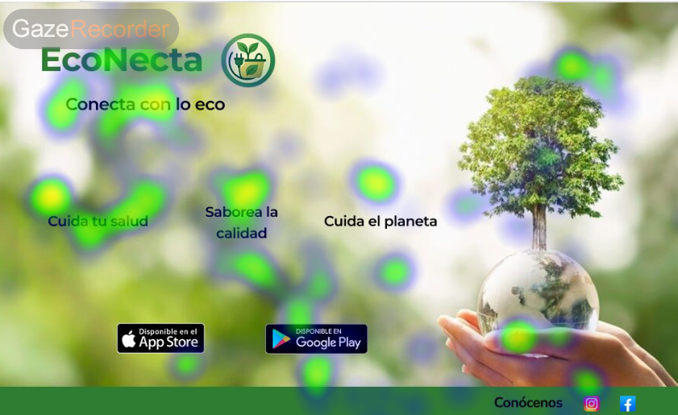
  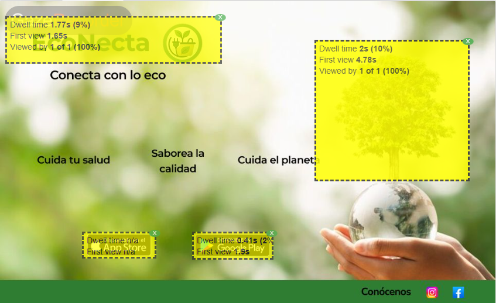

 

Por lo general, consideramos que la lading page es muy correcta. Los enlaces de descarga han resultado elementos de los más llamativos a partir de los datos, que al final es nuestro objetivo como desarrolladores, llamar la atención del usuario para incitar su descarga. El único problema que hemos podido encontrar es que el primer usuario, ha estado mirando más tiempo la imagen de decoración de la derecha que cualquier otro elemento. Es posible que sea demasiado llamativo o que se lleve más atención de la necesaria.

### 4.f Usability Report de B
 
-----

>>> Añadir report de usabilidad para práctica B (la de los compañeros) aportando resultados y valoración de cada debilidad de usabilidad. 
>>> Enlazar aqui con el archivo subido a P4/ que indica qué equipo evalua a qué otro equipo.

>>> Complementad el Case Study en su Paso 4 con una Valoración personal del equipo sobre esta tarea

 

